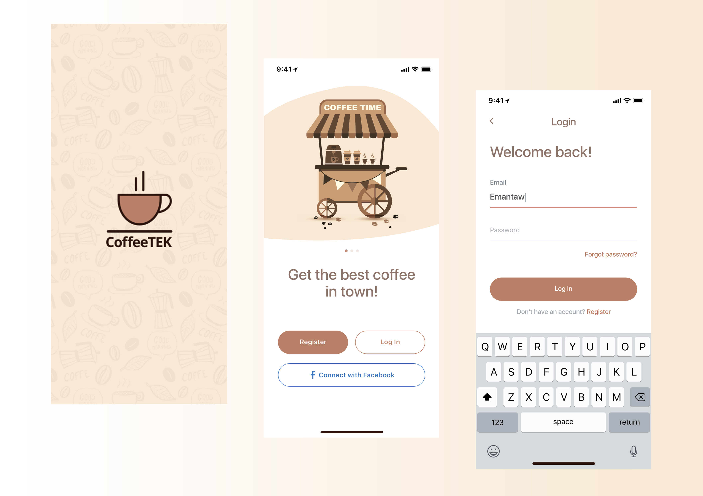
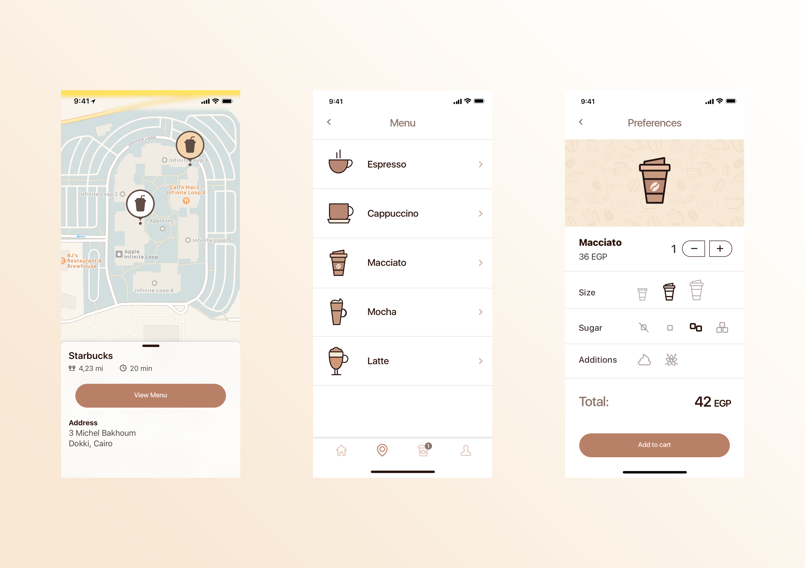
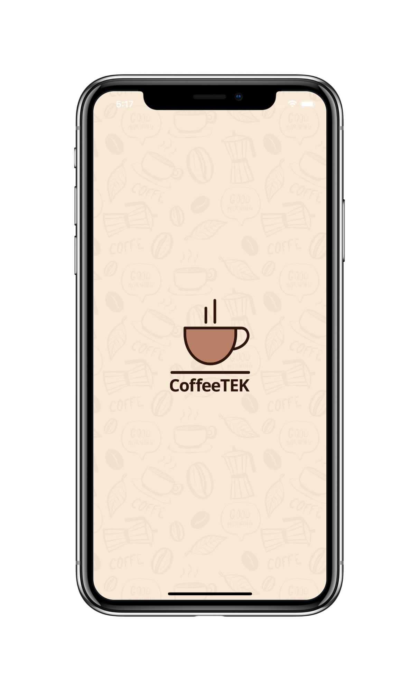
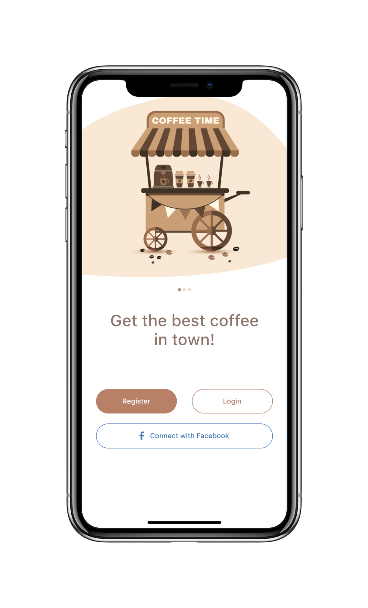
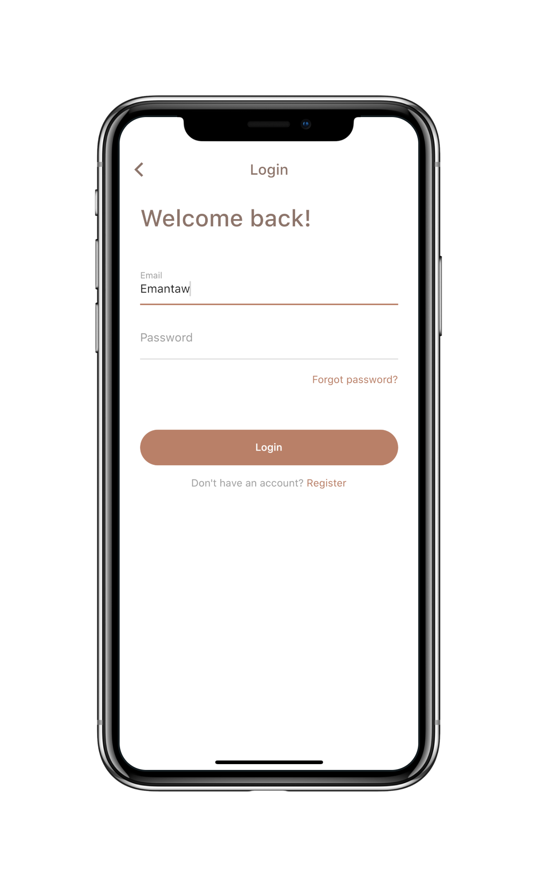
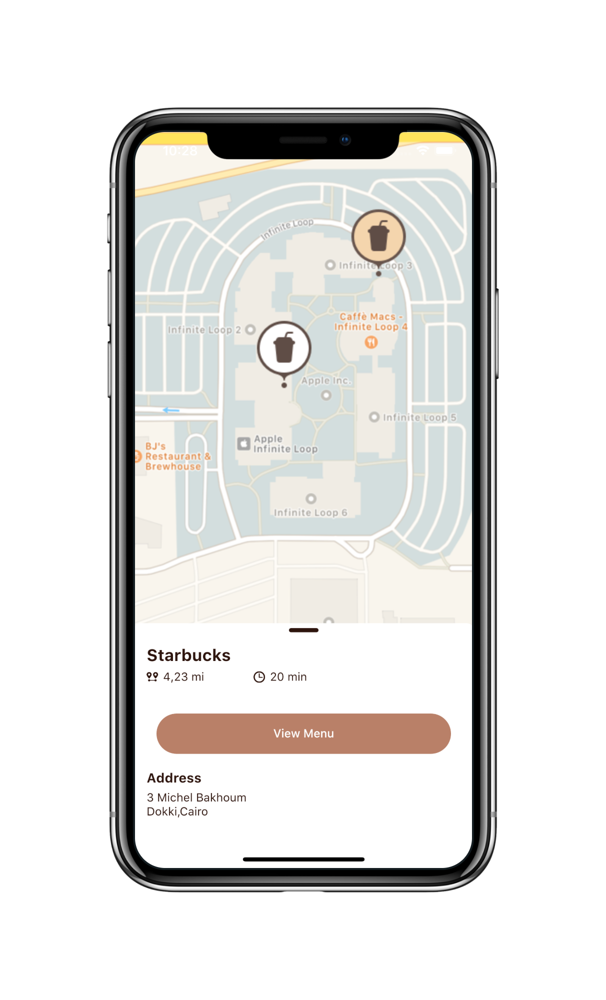
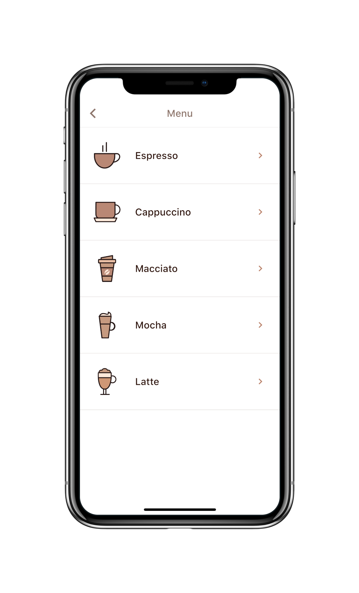
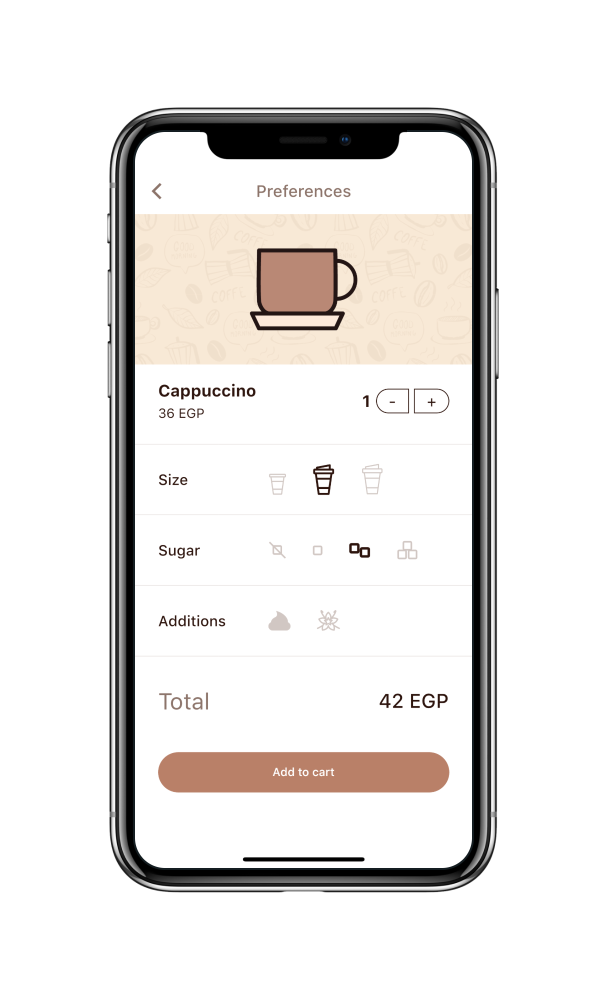

# Flutter UI - Coffee App

English------[中文](README_CN.md)

### Introduction

The coffee application is divided into 3 pages, namely the splash screen page, the main page and the login page.

### Coffee App Design UI

### Coffee App Final UI

     

     

